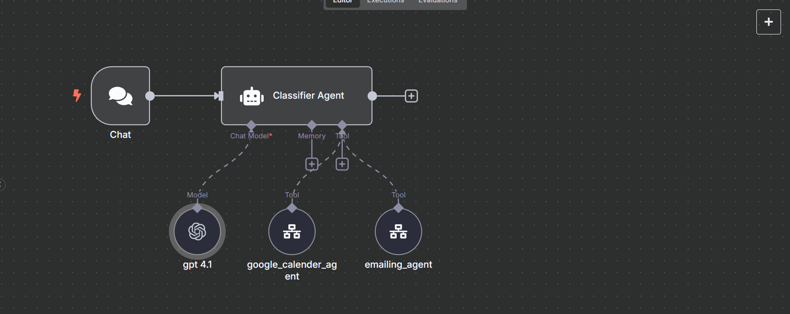
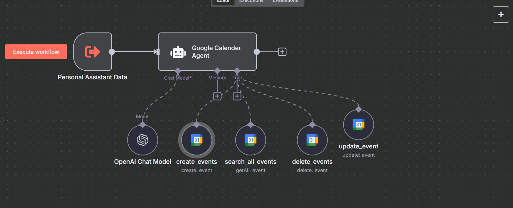
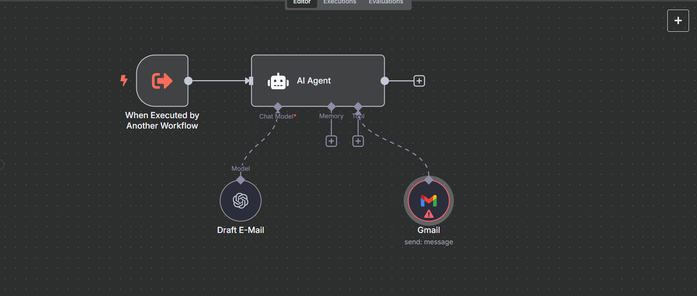

# 🤖 Personal Assistant Workflow using n8n

Welcome! 👋  
I've built a **Personal Assistant** using the powerful open-source automation tool **[n8n](https://n8n.io/)** that helps me manage calendar events and automatically send email updates about them! 📅✉️

---

## ✨ What This Workflow Does

- ✅ **Create calendar events** based on your input or automation triggers  
- 🔍 **Get upcoming events** from your calendar  
- 📬 **Send automated email reminders** to yourself or others  

> 🧩 **Used Sub-Workflow** for:
> - 📆 **Calendar Scheduling**
> - 📤 **Sending Emails to the person**

---

## 🔧 Tools & Integrations Used

- 🛠️ **n8n** for workflow automation  
- 📅 Calendar API (Google Calendar / Outlook / etc.)  
- ✉️ Email service (SMTP, Gmail, etc.)  
- 🧠 Sub-workflows to keep logic modular and clean  

---

## 📌 Features

| Feature | Description |
|--------|-------------|
| 📆 Event Scheduling | Automatically create calendar events |
| 📧 Email Reminders | Send email alerts to notify people |
| 🧱 Sub-Workflows | Modular blocks to reuse logic like email sending |

---

## 🧪 How It Works (In Simple Terms)

1. **Chat Trigger**: A chat trigger starts the flow  
2. **Sub-Workflow 1**: Creates a calendar event  
3. **Sub-Workflow 2**: Sends an email with event details to the person  
4. **Main Workflow**: Coordinates everything seamlessly  

---

## ⚠️ Note

> 🔐 All sensitive data (like API keys and emails) have been removed and replaced with fake placeholders in the shared version.

---

## 📸 Screenshots (Optional)

## Main Agent

## Calender Agent

## E-Mail Agent

---

## 🚀 Want to Try It?

Feel free to download the exported JSON and import it into your own n8n instance.  
Just replace your credentials, calendar, and email settings.

---

## 📢 Connect With Me

Let me know what you think or suggest improvements!  
Tag me if you use this in your own project! 🤝  

#automation #n8n #nocode #emailautomation #calendarbot

